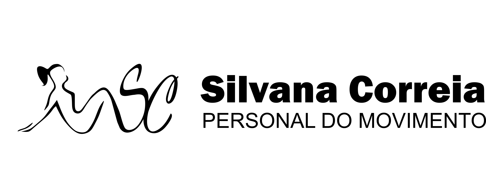
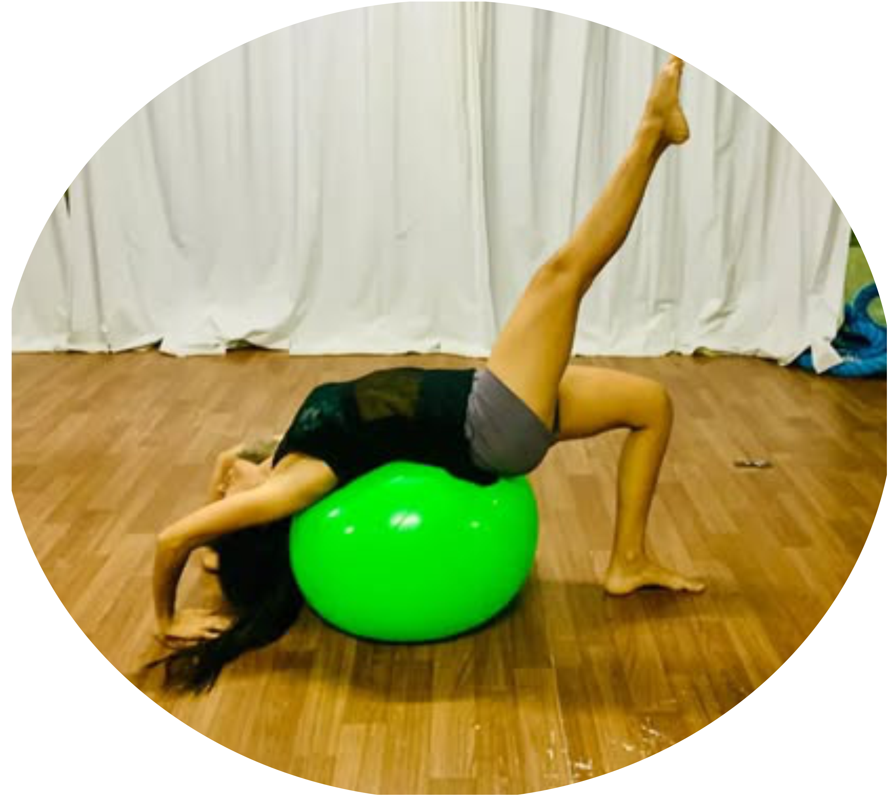
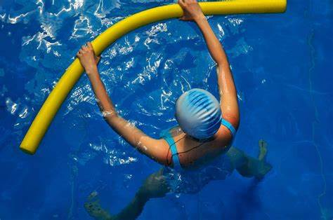
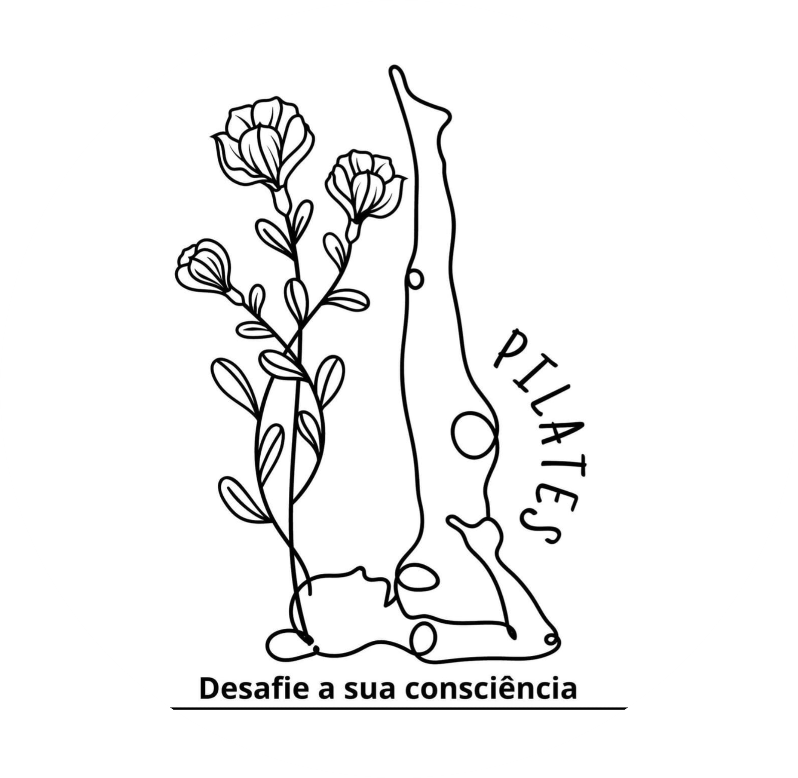

<html lang="pt">
<head>
  <meta charset="UTF-8">
  <meta name="viewport" content="width=device-width, initial-scale=1.0">
  <title>PERSONAL</title>
</head>
<body>
  
  
   
    
   
    <a href="#" class="button1">pilates</a>
    <a href="#" class="button2">psicomotricidade</a>
    <a href="#" class="button3">sobre mim</a>
    <a href="#" class="button4">whatsapp</a>

  

    Sou Profissional de Educação Física tenho mais de quatro anos 
     de experiência, transformando vidas através do metodo Pilates.
     
  

  

    A abordagem individual e em grupo, oferecendo métricas para 
    acompanhar de perto os resultados.
  

  
<h1>
  Metodo Pilates.
</h1>

          O método do pilates utiliza a técnica de diferentes especialidades, como ginástica, fisioterapia, 
  balé e yoga, utilizando a força muscular juntamente com o controle mental, a respiração e o relaxamento.
  Além disso, para garantir os benefícios do pilates, é importante que seja realizado sob orientação de um 
  profissional especializado, pois dessa forma é possível garantir que os exercícios mais indicados para a idade
   e o objetivo sejam realizados corretamente.

  
<h1>
 Pilates Solo.
</h1>

        A hidroginástica é uma grande aliada da terceira idade, muitas 
  vezes crucial para que o idoso tenha uma melhor rotina e qualidade de vida. 
  A pressão da água sobre o corpo auxilia na circulação do sangue, e os exercícios
   ajudam no desenvolvimento do condicionamento cardiorrespiratório, da força, flexibilidade,
  

<footer>

  

    
    

  

  
Atendimento whatsapp 81 997716307

  <a href="mailto:hege@example.com">silvanakscorreia@gmail.com</a>
  
 

</footer> 

</body>
</html>
